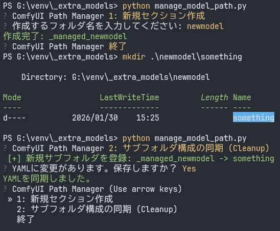

# ComfyUI-manage_model_path

ComfyUIのモデルパスを管理するPythonスクリプトです。外部モデルフォルダにフォルダを作成し、`extra_model_paths.yaml`と同期させます。
PyYAMLとquestionaryが必要です。

```
pip install PyYAML
pip install questionary
```

> [!WARNING]
> 使用前に`manage_model_path.py`をエディタで開き、`YAML_PATH`と`BASE_EXTRA_DIR`をご自分の環境に合わせて書き換えてください。

実行は`python path/to/manage_model_path.py`を実行するか`manage_model_path.bat`を同じフォルダに置いてダブルクリックしてください。

機能は2つあります。

## 1: 新規セクション作成

フォルダ名を入力すると`BASE_EXTRA_DIR`内にフォルダを作成します。同時にサブフォルダ`checkpoints`, `text_encoders`, `diffusion_models`, `loras`, `vae`を作成します。その構成を`extra_model_paths.yaml`に`_managed_フォルダ名`というセクション名で書き込みます。

## 2: サブフォルダ構成の同期 (Cleanup)
`extra_model_paths.yaml`を読み込み現在のフォルダ構成に合わせて更新します。yamlに定義が存在しないサブフォルダがあれば`小文字にしたフォルダ名:"フォルダ名/"`で追加するようにします。逆にyamlにあるのにサブフォルダが存在しない場合はyamlから削除します。フォルダ自体がなくなっていれば`_managed_フォルダ名`セクションを削除します。

同期対象のデータは`_managed_`で始まるセクションのみなので、他で編集した項目は保護されます。ただし処理過程でコメントは削除されます。


