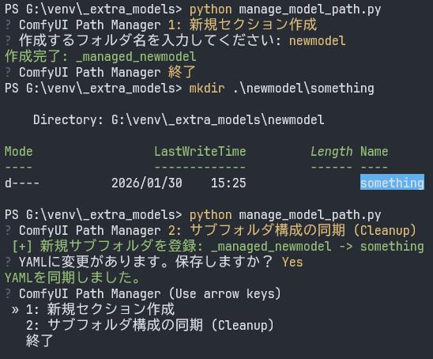

# ComfyUI-manage_model_path

[ [English](README-en.md) ]

ComfyUIのモデルパスを管理するPythonスクリプトです。外部モデルフォルダにフォルダを作成し、`extra_model_paths.yaml`と同期させます。
PyYAMLとquestionaryが必要です。

```
pip install PyYAML
pip install questionary
```

## 使い方

機能は2つあります。

#### 1: 新規セクション作成

フォルダ名を入力すると追加モデルフォルダ内にフォルダを作成します。同時にサブフォルダ`checkpoints`, `text_encoders`, `diffusion_models`, `loras`, `vae`を作成します。その構成を`extra_model_paths.yaml`に`_managed_フォルダ名`というセクション名で書き込みます。

フォルダが既に存在する場合は、yamlに登録するか聞いてくるので、許可すると新規セクションを書き込みます。

#### 2: サブフォルダ構成の同期 (Cleanup)

`extra_model_paths.yaml`を読み込み現在のフォルダ構成に合わせて更新します。yamlに定義が存在しないサブフォルダがあれば`フォルダ名:"フォルダ名/"`で追加するようにします。逆にyamlにあるのにサブフォルダが存在しない場合はyamlから削除します。フォルダ自体がなくなっていれば`_managed_フォルダ名`セクションを削除します。

同期対象のデータは`_managed_`で始まるセクションのみなので、他の方法で追加した項目は保護されます。ただし処理過程でコメントは削除されます。

### 実行方法

コマンドライン引数を使用して、パスやフォルダ名を指定することができます。

```bash
# ヘルプを表示
python manage_model_path.py --help

# パスを指定して実行
python manage_model_path.py -c "G:/venv/Comfy/ComfyUI" -e "G:/venv/_extra_models"

# 言語を指定して実行
python manage_model_path.py -l ja

# 全てのオプションを指定
python manage_model_path.py -c "G:/venv/Comfy/ComfyUI" -e "G:/venv/_extra_models" -l ja "my_model_folder"
```

`manage_model_path_example.bat`は各パスを指定して起動するサンプルです。

#### コマンドラインオプション

| オプション | 短縮形 | 説明 |
|-----------|--------|------|
| `--comfy-path` | `-c` | ComfyUIのルートパス |
| `--extra-model-path` | `-e` | 追加モデルのルートパス |
| `--lang` | `-l` | 表示言語（enまたはja） |
| `folder_name` | - | 直接作成するフォルダ名（オプション） |

### 対話モード

引数なしで起動するとComfyUIのルートパスと追加モデルのルートパスの入力を求められます。


